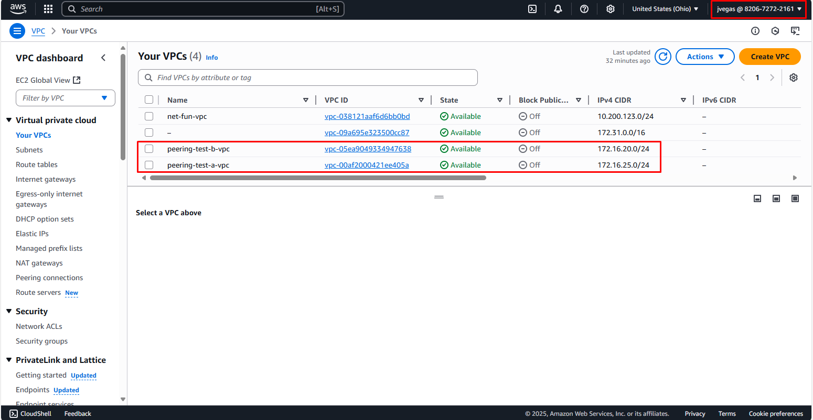
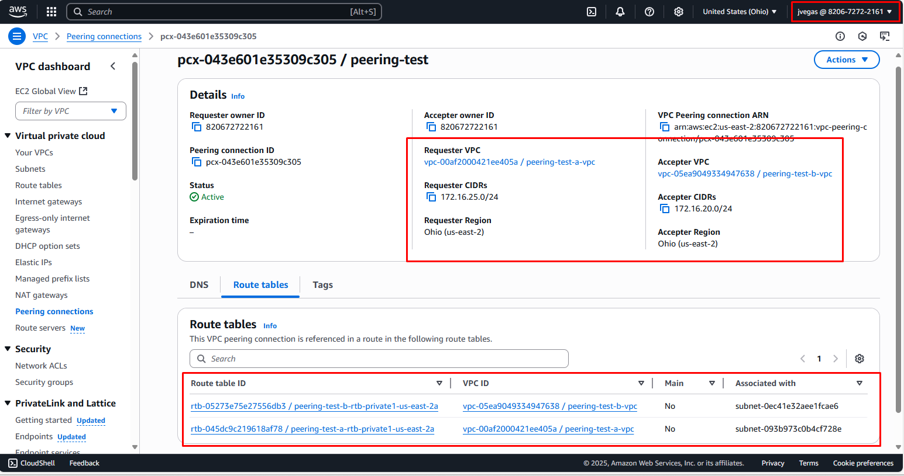

# AWS VPC Peering

For our AWS VPC peering proof of concept two VPCs with two availability zones each were created:

Each VPC has two public subnets and two private subnets:

To establish a peering in AWS a **peering connection** is required, it was created under the name **peering test**.

It is necessary to configure a **requester VPC** (peering-test-a-vpc) and an **accepter VPC** (peering-test-b-vpc) during the process, and once the connection is created it must be explicitly approved within a week.

Even then, it is not possible to send or receive traffic at this point (the peering connection only represents a medium), so the route tables must be configured to allow communication between subnets across connected VPCs:

In the above image, you can see **peering test** associated with two route tables:

* peering-test-a-rtb-private1-us-east-2a associated with peering-test-a-subnet-private1-us-east-2a
* peering-test-b-rtb-private1-us-east-2a associated with peering-test-b-subnet-private1-us-east-2a

This configuration allows traffic to flow between the subnets associated with those route tables (we keep it within the same availability zone to save costs). For it to work as expected, the configuration must be applied to each route table; otherwise, bidirectional communication is not possible.

Below, you can see that the route configured for **peering-test-a-subnet-private1-us-east-2a** can send traffic to **peering-test-b-subnet-private1-us-east-2a**. Note that the target must be **peering test**:

Next, you can see the route for **peering-test-b-subnet-private1-us-east-2a** can communicate with **peering-test-a-subnet-private1-us-east-2a**.

Now, you can either instantiate resources in both subnets to send traffic between them or configure other peerings with the remaining subnets.
