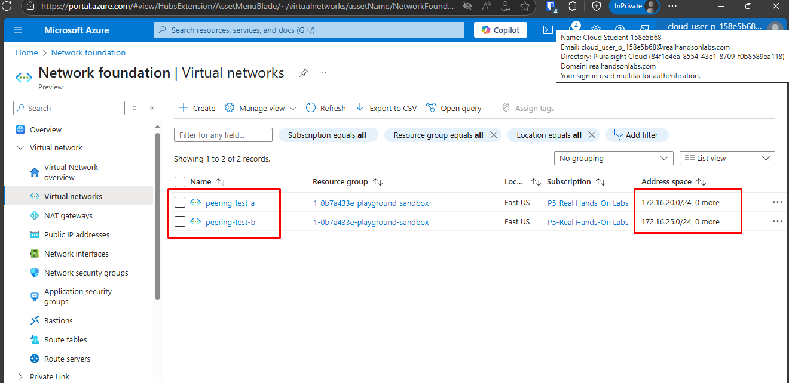
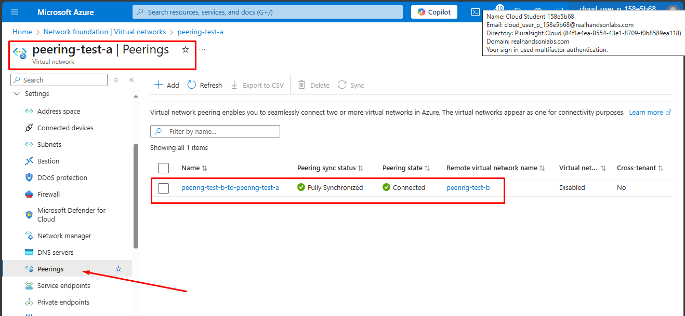
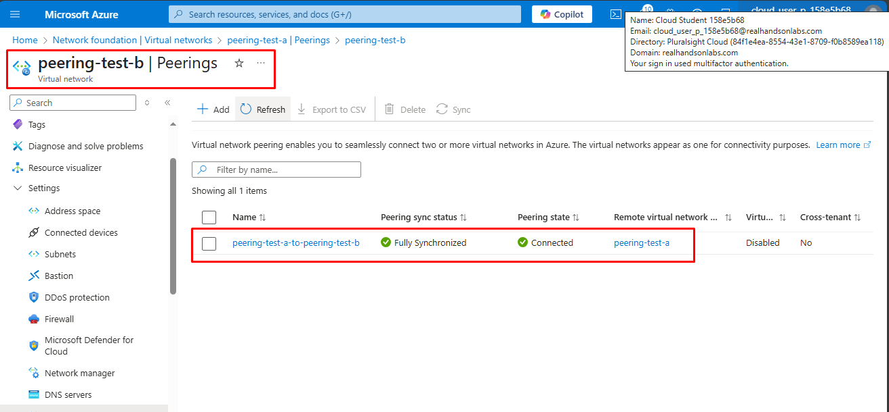
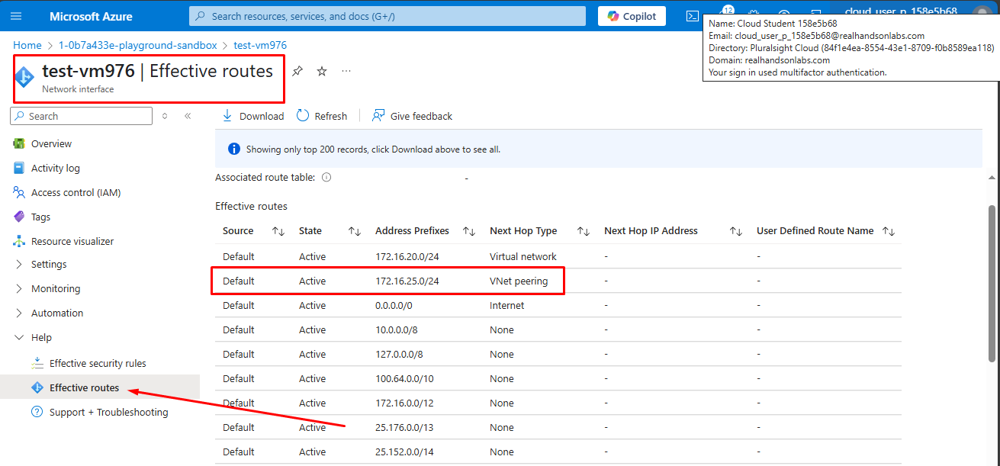

# Azure Virtual Network Peering

For our Azure Virtual Network peering proof-of-concept, two virtual networks with non-overlapping address spaces were created (the peering procedure would fail otherwise):

In the **Peerings** pane of each virtual network you can create the connections required to allow traffic between them. The Azure Portal can create both sides of the peering in a single step (you need to configure each side of the peering separately when using the Azure CLI).

Below, you can see **peering-test-a** side of the peering:

Next, you can see **peering-test-b** side of the peering:

Finally, you can see the **Effective routes** (which are managed by Azure, unlike AWS where you need to configure the route tables) of a network interface attached to **peering-test-a**. The **VNet peering** hop points to the **peering-test-b** address space:

