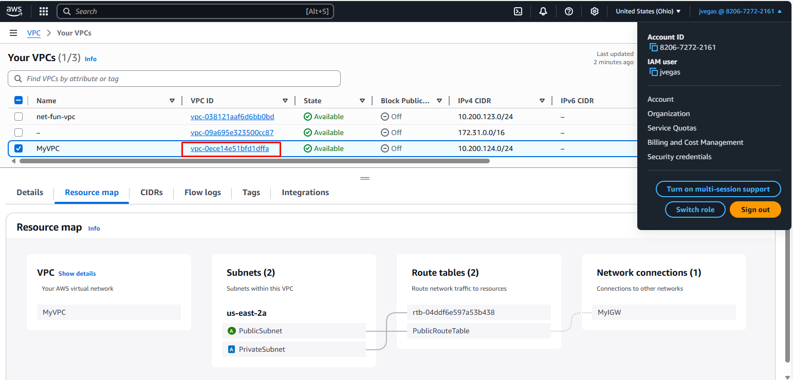
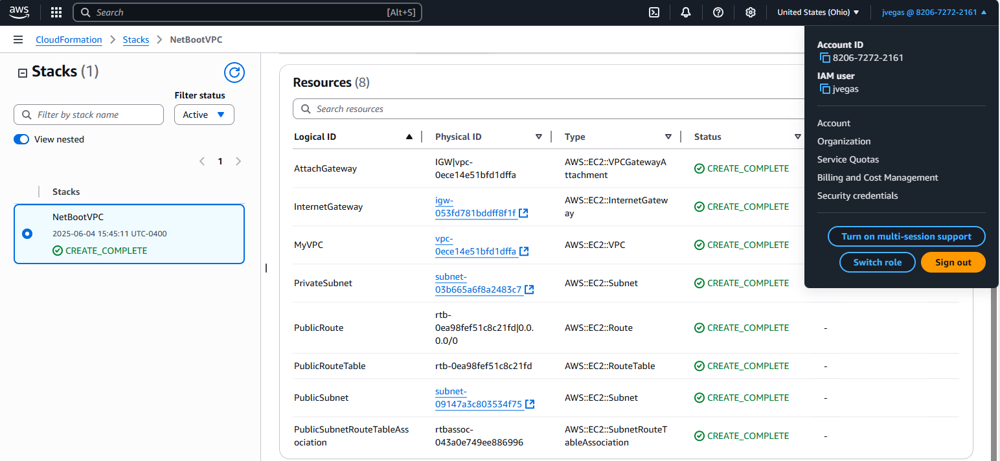

# VPC Settings

These are the VPC Settings Andrew listed based in Tim's video for cloud enviroment in AWS. I need to change the original CIDR block as I already have a VPC with that range:

- VPC IPv4 CIDR Block: 10.200.124.0/24
- Ipv6 CIDR Block: No
- Number of AZs: 1
- Number of public subnets: 1
- Number of private subnets: 1
- NAT GATEWAYS: None
- VPC Endpoints: None
- DNS Options: Enable DNS Hostnames
- DNS options: Enable DNS Resolution

## Generated and Review CFN Template

I used Andrew's CNF template which he generated using ChatGPT. He needed to guide the LLM to give him reusable code (declaring parameters) which is very important in while writing idempontent instructions in IaC.

## Generated Deploy Script

Again Andrew generated a bash script in `bin/deploy` generated by ChatGPT.

The script was made platform agnostic by modifying the shebang.

Use CodeRabbit to check for issues before committing changes to teh branch. It suggested validation code to check for AWS CLI been installed and valid AWS credentials present before running the script. I accepted the changes.

## Visulization in Infrastructure Composer

This is placeholder for the infrastructure diagram. Even if it was autogenerated with AWS Infrastructure Composer it wasn't good enough quality.

## Intalling AWS CLI

I followed the install instructions:

https://docs.aws.amazon.com/cli/latest/userguide/getting-started-install.html

It was necessary to exclude installation files using the `.gitignore` to keep a clean repository.

## Deployed Resource to AWS

This is the resource map of the VPC deployed with CFN.

This is the CloudFormation stack in the AWS Console

