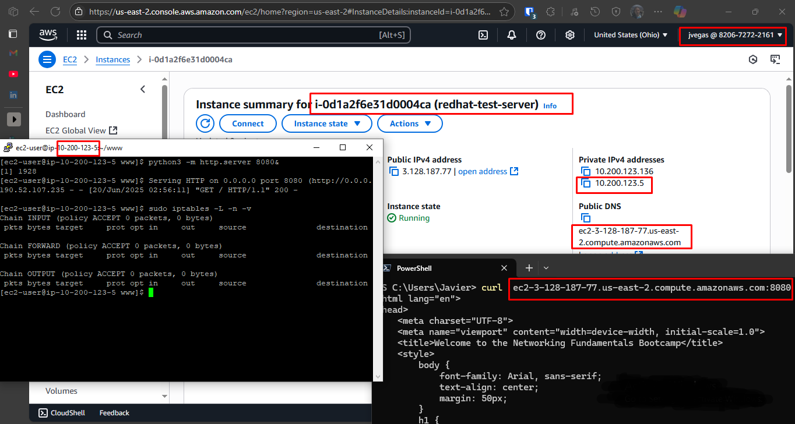

# Project Journal

I used RHEL as the Linux distribution for this proof of concept.

Firewlld was enabled in this instance due to previous tests. It had to be disabled to prevent it for starting at boot which could conflict with iptables rules (installed by default in this distribution).

A directory `www` was created in the home folder to hold an index.html file which would be served by the python server.

I started a Python web server by running:

```sh
 python3 -m http.server 8080&
```

The `&` at the end of the command instruct allows for the web server to run in the background so that I could still use the shell.

Iptables doesn't need explicit incomming traffic rules to allow access to port 8080 where the python webserver is running. So as long as port 8080 is open in the AWS security group, `curl` requests load the test page.



A rules was added to silently drop traffic to 8080 (recommended over "reject" because it doesn't confirm existence to potential port scanning)

We will attempt to redirect traffic from port 7000 to port 8080 externally while keeping the drop rule in place.