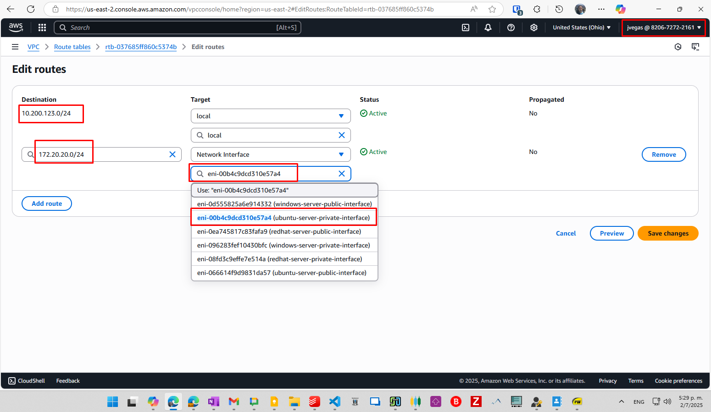
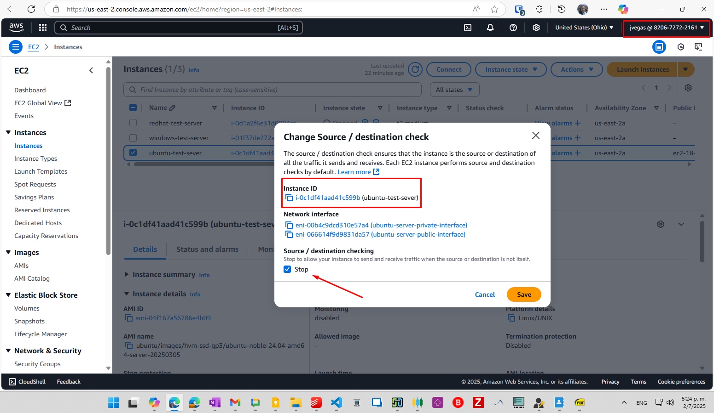

# Load Balancer with HAProxy Journal

## Environment

An AWS EC2 instance running an Ubuntu server with **containerlab** (and **docker**) installed was used to run the containers needed for this proof of concept (a load balancer and two web servers).

Also, another EC2 instance running Windows Server 2025 was used to request the pages in the web servers behind the load balancer.

## Deployment

