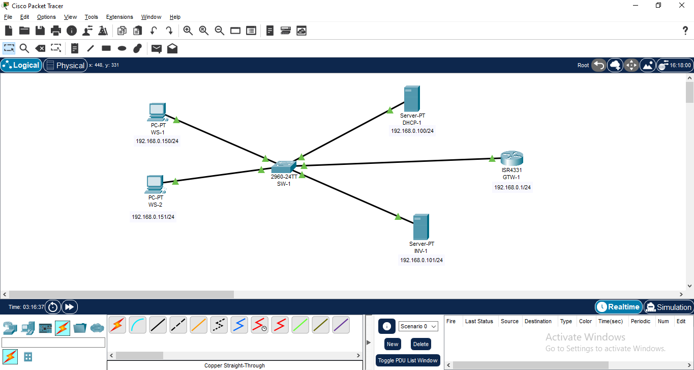

# State of the Network

In testing Packet Tracert capabilities I simulated a network in the `192.168.0.0/24` address space, that included:

- Two (o more) workstations.
- An access switch (SW-1).
- A DHCP server (DHCP-1).
- An IT assets inventory (INV-1).
- A router/gateway (GTW-1).

DHCP-1 has an static IP address and serves all DHCP clients in the network (100 at most) starting with IP `192.168.0.150` up to IP `192.168.0.249`.

INV-1 has an static IP and is configured with OCS inventory to store all the details of workstation and servers in the network.

GTW-1 is configure to exit the network directly into the internet and is also the network's dns server.

SW-1 connects all network devices. The network is not segmented so there is only one VLAN.
