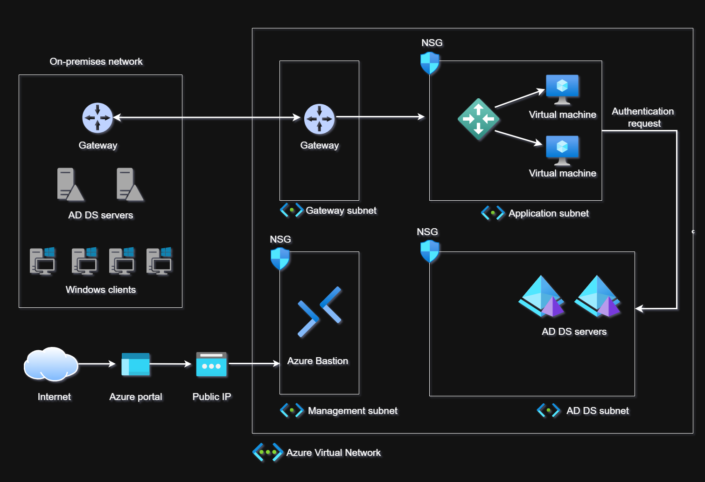

# Active Directory Domain extended to Azure - Overview

This architecture allows for the client's on-premises Active Directory environment to be extended to Azure using a site-to-site VPN, supporting the legacy app authentication requests without contacting the on-premises network.

If you wish, you can [watch a video explanation of this diagram](https://www.youtube.com/watch?v=RCzJrjyuzJI).

You can see a [version of this diagram](./assets/network-diagram.drawio.png), too.

If you need to make changes, you can [make a copy of this diagram](./assets/network-diagram.drawio). You'll need to use **draw.io** to open the file, there's a [web version](https://app.diagrams.net/) and an [offline version](https://www.drawio.com/) of this software (no registration is required to use it).

## Key Design Choices

- The VPN tunnel to connect the local network to Azure can be created with either [Azure ExpressRoute](https://learn.microsoft.com/en-us/azure/expressroute/expressroute-introduction) or [Azure VPN Gateway](https://learn.microsoft.com/en-us/azure/vpn-gateway/vpn-gateway-about-vpngateways) (represented in the diagram), however, the latter should be preferred for this specific use case as it is this most cost-effective choice.

- The client has two domain controllers to support the on-premises Active Directory Domain environment which adds resiliency and reliability to the service. It is recommended to keep the same thought process when deploying domain controllers to Azure.

- Both, the local network and the Azure Virtual Network, must have different address spaces to be able to connect.

- The application subnet must be added to the Active Directory Site on Azure so that the application servers prefer those domain controllers for authentication.

## Key Security Considerations

- The domain controllers shouldn't be directly exposed to the internet, all related Active Directory traffic **must** travel through encrypted channels only.

- To have a fallback connection (for management purposes), in case the VPN tunnel fails or access is needed from outside the corporate network, an Azure Bastion should be deployed in the Azure Virtual Network to enable secure RDP traffic to the domain controllers without exposing them to the internet.

If you have any questions or need to revise this design don't hesitate to reach out to me.
