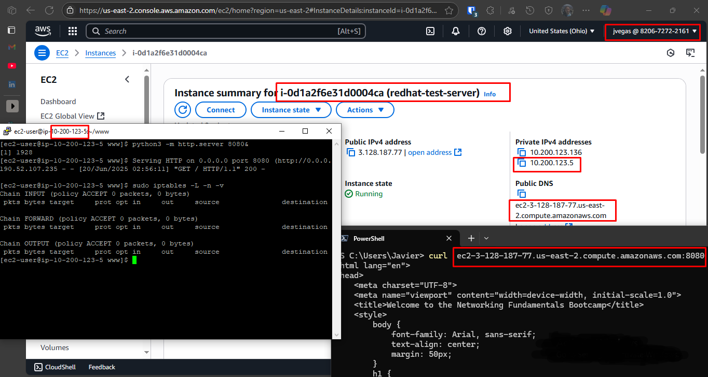
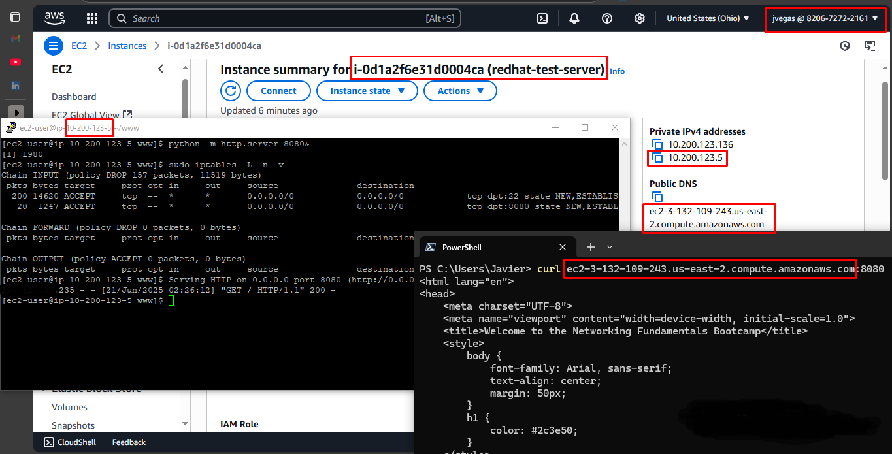

# Project Journal

I used RHEL as the Linux distribution for this proof of concept.

Firewalld was enabled in this instance due to previous tests. It had to be disabled to prevent it from starting at boot which could conflict with iptables rules (installed by default in this distribution).

A directory `www` was created in the home folder to hold an index.html file which would be served by the python server.

I started a Python web server by running:

```sh
 python3 -m http.server 8080&
```

The `&` at the end of the command allows for the web server to run in the background so that I could still use the shell.

By default, iptables accept all incoming, forwarded and outgoing traffic:

```sh
[ec2-user@ip-10-200-123-5 www]$ sudo iptables -L -n -v
Chain INPUT (policy ACCEPT 0 packets, 0 bytes)
 pkts bytes target     prot opt in     out     source               destination

Chain FORWARD (policy ACCEPT 0 packets, 0 bytes)
 pkts bytes target     prot opt in     out     source               destination

Chain OUTPUT (policy ACCEPT 0 packets, 0 bytes)
 pkts bytes target     prot opt in     out     source               destination
```

As you can see, the `ACCEPT` policy is configured in the three chains.

So as long as port 8080 is open in the AWS security group, `curl` requests load the test page.



Modern firewalls must be configured to block all incoming traffic which hasn't been explicitly allowed.

I proceed to lock down the server by adding a rule to accept incoming ssh traffic (to prevent being  locked out of the server when setting the drop policy):

```sh
sudo iptables -A INPUT -p tcp --dport 22 -m state --state NEW,ESTABLISHED -j ACCEPT
```

Followed by a rule to allow traffic to port 8080 (the Python server):

```sh
sudo iptables -A INPUT -p tcp --dport 8080 -m state --state NEW,ESTABLISHED -j ACCEPT
```

Finally I hardened the server by setting the policy for inbound and forwarded traffic to `DROP`:

```sh
sudo iptables -P FORWARD DROP
sudo iptables -P INPUT DROP
```

The final result:

```sh
[ec2-user@ip-10-200-123-5 www]$ sudo iptables -L -n -v
Chain INPUT (policy DROP 15 packets, 924 bytes)
 pkts bytes target     prot opt in     out     source               destination
   46  3552 ACCEPT     tcp  --  *      *       0.0.0.0/0            0.0.0.0/0            tcp dpt:22 state NEW,ESTABLISHED
   15   987 ACCEPT     tcp  --  *      *       0.0.0.0/0            0.0.0.0/0            tcp dpt:8080 state NEW,ESTABLISHED

Chain FORWARD (policy DROP 0 packets, 0 bytes)
 pkts bytes target     prot opt in     out     source               destination

Chain OUTPUT (policy ACCEPT 0 packets, 0 bytes)
 pkts bytes target     prot opt in     out     source               destination

```

I tested the `curl` command again to validate I could still load the test page with the new rules applied:



To persist the rules across reboots I ran `sudo iptables-save`:

```sh
[ec2-user@ip-10-200-123-5 www]$ sudo iptables-save
# Generated by iptables-save v1.8.11 (nf_tables) on Sat Jun 21 02:46:29 2025
*filter
:INPUT DROP [355:37146]
:FORWARD DROP [0:0]
:OUTPUT ACCEPT [0:0]
-A INPUT -p tcp -m tcp --dport 22 -m state --state NEW,ESTABLISHED -j ACCEPT
-A INPUT -p tcp -m tcp --dport 8080 -m state --state NEW,ESTABLISHED -j ACCEPT
COMMIT
# Completed on Sat Jun 21 02:46:29 2025

```

For the sake of time I skipped port redirection for a later time, but it would be very useful for disguising services from port scanning.
