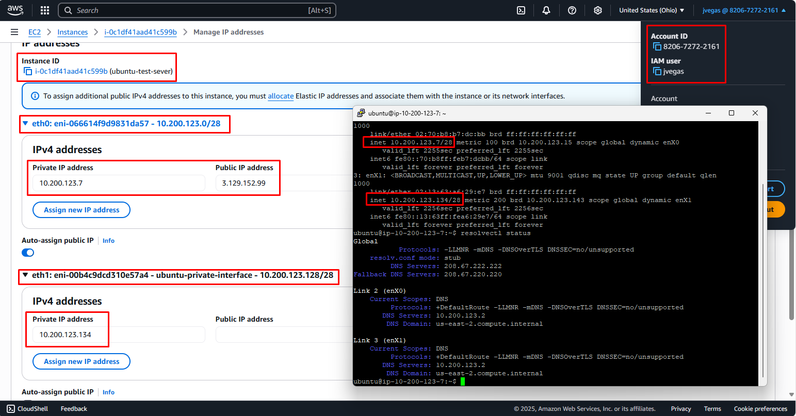

# Project Journal

## DNS Resolvers



As you asked me in our last meeting, I could confirm that the DNS resolvers can be change in Linux by editing the `/etc/systemd/resolved.conf` file.

You can check the current status of the resolvers with:

```sh
resolvectl status
```

As you can see in the above image, I used the OpenDNS resolvers for this demonstration.

## Wget vs Curl

I understand you need more information about the differences between `Wget` and `curl`.

`Wget` is mostly used for downloading files and full webpages (as it can follow redirects). Also, because it can work in the background non-interactively it can continue the downloading process even if the user is log off.

```sh
wget exampro.co
--2025-06-11 15:38:46--  http://exampro.co/
Resolving proxy.ucab.edu.ve (proxy.ucab.edu.ve)... 200.2.15.208, 200.2.15.210, 200.2.15.205, ...
Connecting to proxy.ucab.edu.ve (proxy.ucab.edu.ve)|200.2.15.208|:3128... connected.
Proxy request sent, awaiting response... 301 Moved Permanently
Location: http://www.exampro.co/ [following]
--2025-06-11 15:38:46--  http://www.exampro.co/
Reusing existing connection to proxy.ucab.edu.ve:3128.
Proxy request sent, awaiting response... 301 Moved Permanently
Location: https://www.exampro.co/ [following]
--2025-06-11 15:38:46--  https://www.exampro.co/
Connecting to proxy.ucab.edu.ve (proxy.ucab.edu.ve)|200.2.15.208|:3128... connected.
Proxy request sent, awaiting response... 200 OK
Length: 2292 (2.2K) [text/html]
Saving to: ‘index.html’

index.html                    100%[=================================================>]   2.24K  --.-KB/s    in 0s

2025-06-11 15:38:47 (266 MB/s) - ‘index.html’ saved [2292/2292]
```

The above output shows the `wget` command downloading the `index.html` file from `exampro.co`

`curl` is most used to transfers data from or to a server using URLs in a variety of protocols, that's why is very popular to target APIs.

```sh
curl google.com
<HTML><HEAD><meta http-equiv="content-type" content="text/html;charset=utf-8">
<TITLE>301 Moved</TITLE></HEAD><BODY>
<H1>301 Moved</H1>
The document has moved
<A HREF="http://www.google.com/">here</A>.
</BODY></HTML>
```

The output shows a request made to `google.com` and the default response. In the real world the request would have been made to a service to either get, write or modify data.
