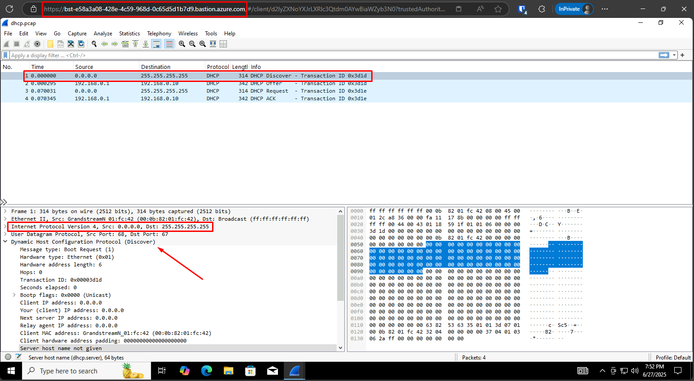
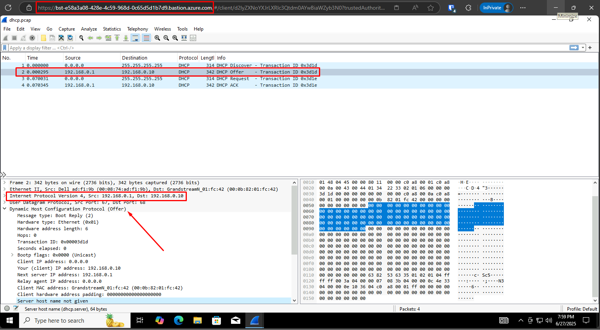
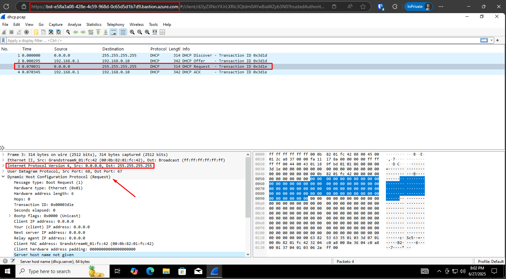
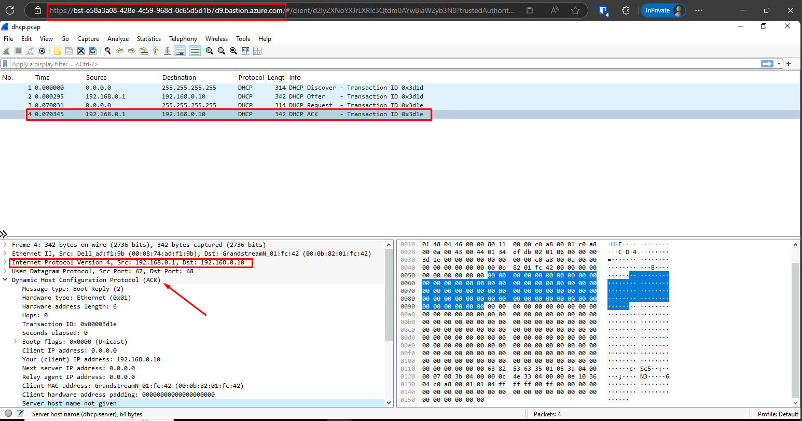
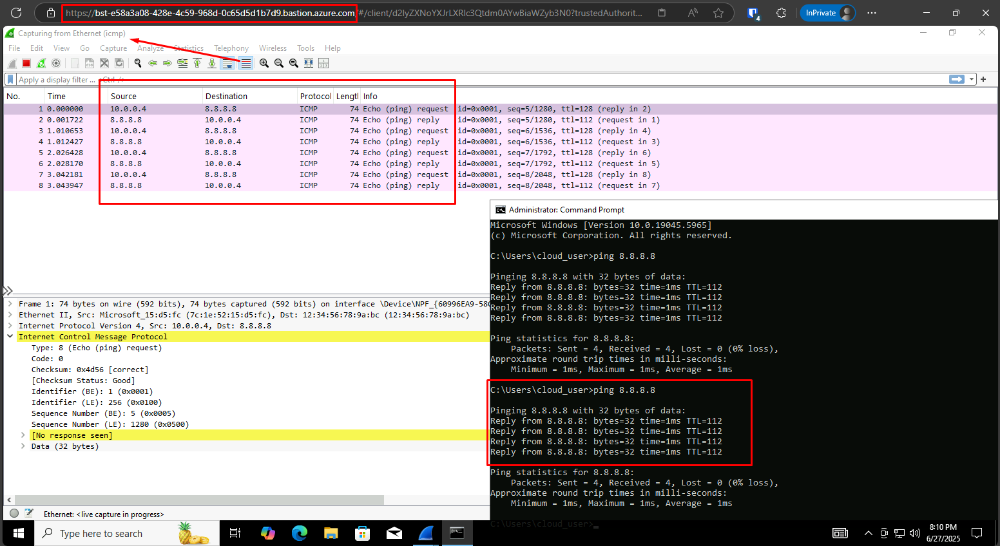

# Traffic flow with Wireshark Journal

## Environment

A virtual machine running Windows 10 Pro in Azure (accessed through an Azure Bastion instance) is used for this demonstration. The latest version of Wireshark was installed.

The **pcap file** needed for the demo was downloaded from <https://wiki.wireshark.org/SampleCaptures#general--unsorted>, specifically **dhcp.pcap**, there are many other demo files you can use for practice.

## Packet Analysis

First, you need to know that for network traffic analysis a base level of packet structure is required to read the information shown in Wireshark in an effective way.

For instance, once you open **dhcp.pcap** in Wireshark, you immediately see four packets. In the **info** column you can infer this traffic is related to a DHCP request because the packets are using the DORA flow (discover, offer, request, ack) which is inherent from this protocol.

### Discover

Above, you can see the details of the **discover** packet. The client sends a broadcast to the network (`255.255.255.255`) in search of a DHCP server. Note that the client uses the source address `0.0.0.0` as it doesn't have an IP yet.

### Offer

Next, the DHCP server (with the IP `192.168.0.1`) responds to the client with an available IP (`192.168.0.10`) among other information.

### Request

The third packet shows the **request** sent from the client to confirm it accepts the IP from the **offer** packet.

### Ack

Finally, the DHCP server sends an **ack** packet to confirm that the mentioned IP is been reserved for the client use in the network.

### Local packet capture

If you need to capture application traffic, you can use the **capture** feature in Wireshark and then download the resulting **pcap** file for further analysis. You can send the captured packets to the networking team is you need to make sense of the traffic in the network related layers.

Above, you can see a live packet capture which is showing the ICMP traffic from a ping to the `8.8.8.8` address.
