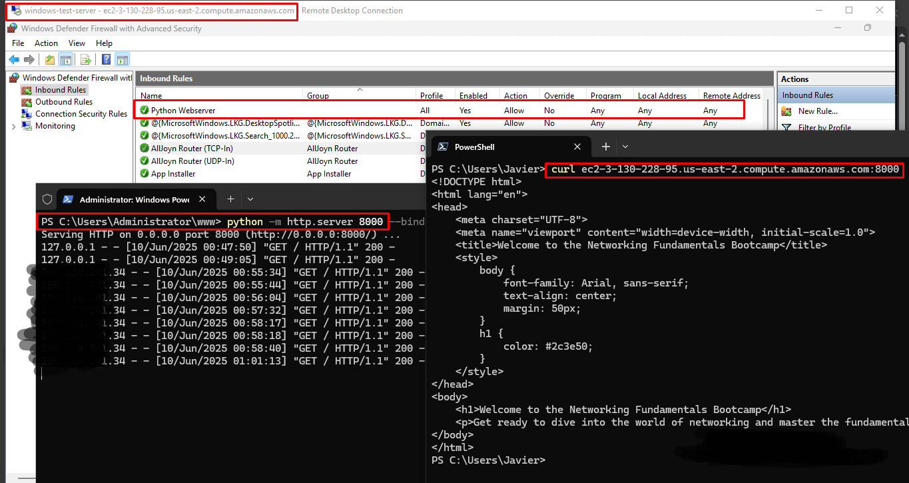

# Project Journal

## Initial sept up

After installing Python, a test webpage called `index.html` was generated using Copilot.

The webpage was served using:

```sh
python -m http.server 8000
```

## Creating firewall rules

By default, all incoming traffic is blocked by the Windows Firewall unless explicitly allowed.

A rule called "Python Webserver" was created to open incoming TCP traffic through port 8000.

An inbound rule was created in the EC2 instance security group so traffic could pass from the public Internet.

The server was reachable using the `curl` command from both the local server and outside the EC2 instance's VPC:

```sh
curl http://127.0.0.1:8000
```



Proof of working Python Webserver from inside (127.0.0.1) and outside the VPC (redacted public IP).
