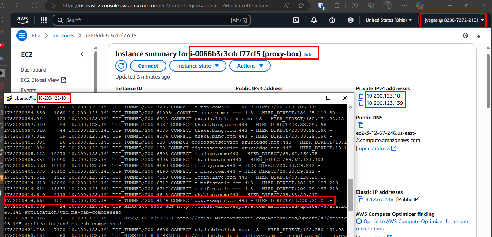
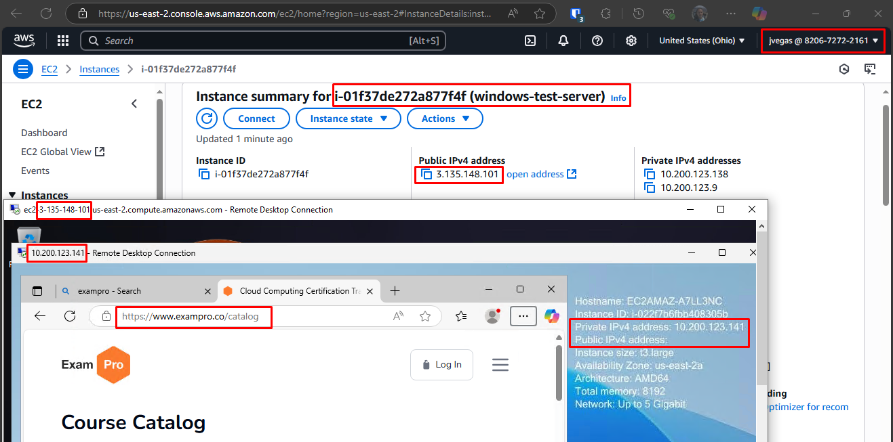
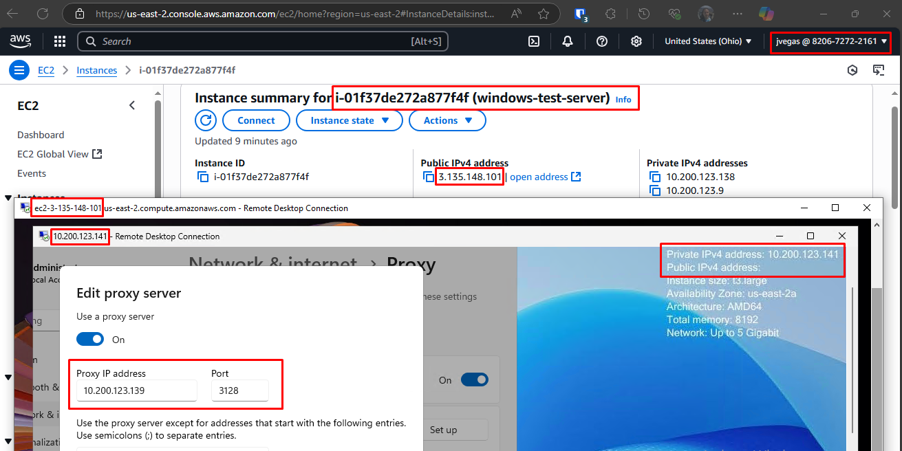
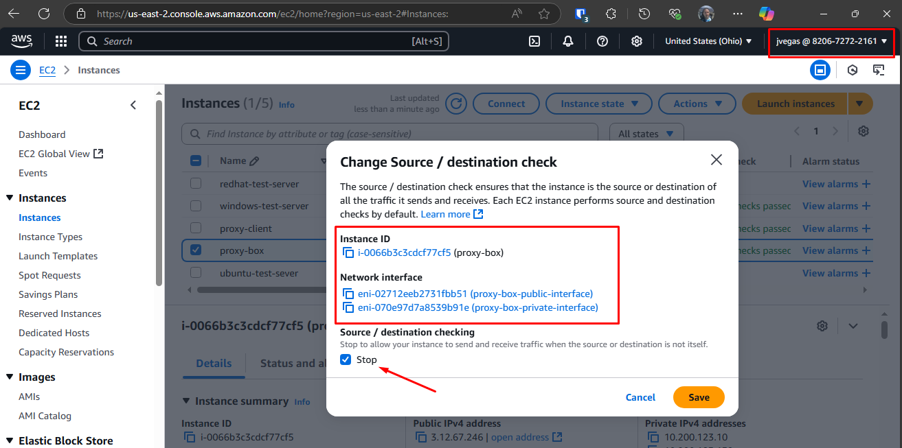

```sh
ubuntu@ip-10-200-123-10:~$ history
    1  sudo apt update
    2  sudo apt install squid
    3  history
    4  clear
    5  sudo systemctl status squid
    6  sudo systemctl daemon-reload
    7  sudo systemctl status squid
    8  cat /etc/squid/squid.conf | more
    9  cat /etc/squid/squid.conf | grep -v '^#' | grep -v '^$'
   10  ip addr
   11  vim /etc/squid/squid.conf
   12  sudo vim /etc/squid/squid.conf
   13  cat /etc/squid/squid.conf | grep -v '^#' | grep -v '^$'
   14  sudo vim /etc/squid/squid.conf
   15  cat /etc/squid/squid.conf | grep -v '^#' | grep -v '^$'
   16  ip addr
   17  ping google.com
   18  cat /etc/squid/squid.conf | grep -v '^#' | grep -v '^$'
   19  logout
   20  history
   21  sudo tail -f /var/log/squid/access.log
```

```sh
ubuntu@ip-10-200-123-10:~$ cat /etc/squid/squid.conf | grep -v '^#' | grep -v '^$'
acl localnet src 10.200.123.128/28
acl SSL_ports port 443
acl Safe_ports port 80          # http
acl Safe_ports port 443         # https
http_access deny !Safe_ports
http_access deny CONNECT !SSL_ports
http_access allow localhost
include /etc/squid/conf.d/*.conf
http_access allow localnet
http_access deny all
http_port 3128
access_log daemon:/var/log/squid/access.log squid
coredump_dir /var/spool/squid
refresh_pattern ^ftp:           1440    20%     10080
refresh_pattern -i (/cgi-bin/|\?) 0     0%      0
refresh_pattern \/(Packages|Sources)(|\.bz2|\.gz|\.xz)$ 0 0% 0 refresh-ims
refresh_pattern \/Release(|\.gpg)$ 0 0% 0 refresh-ims
refresh_pattern \/InRelease$ 0 0% 0 refresh-ims
refresh_pattern \/(Translation-.*)(|\.bz2|\.gz|\.xz)$ 0 0% 0 refresh-ims
refresh_pattern .               0
```

```sh
ubuntu@ip-10-200-123-10:~$ sudo tail -f /var/log/squid/access.log
1752030357.582     12 10.200.123.141 TCP_MISS_ABORTED/503 4019 GET http://ipv6.msftconnecttest.com/connecttest.txt - HIER_DIRECT/2600:1407:b800::6872:4fd0 text/html
1752030357.582     11 10.200.123.141 TCP_MISS_ABORTED/503 4019 GET http://ipv6.msftconnecttest.com/connecttest.txt - HIER_DIRECT/2600:1407:b800::6872:4fd0 text/html
1752030357.622     20 10.200.123.141 TCP_MISS/200 275 GET http://www.msftconnecttest.com/connecttest.txt - HIER_DIRECT/23.200.156.204 text/plain
1752030357.624     22 10.200.123.141 TCP_MISS/200 275 GET http://www.msftconnecttest.com/connecttest.txt - HIER_DIRECT/23.200.156.204 text/plain
1752030358.048     64 10.200.123.141 TCP_MISS/200 5275 GET http://ctldl.windowsupdate.com/msdownload/update/v3/static/trustedr/en/disallowedcertstl.cab? - HIER_DIRECT/217.20.63.34 application/vnd.ms-cab-compressed
1752030358.106     32 10.200.123.141 TCP_MISS/200 5275 GET http://ctldl.windowsupdate.com/msdownload/update/v3/static/trustedr/en/disallowedcertstl.cab? - HIER_DIRECT/217.20.63.34 application/vnd.ms-cab-compressed
1752030358.109     23 10.200.123.141 TCP_MISS/200 961 GET http://ocsp.digicert.com/MFEwTzBNMEswSTAJBgUrDgMCGgUABBQ50otx%2Fh0Ztl%2Bz8SiPI7wEWVxDlQQUTiJUIBiV5uNu5g%2F6%2BrkS7QYXjzkCEAUZZSZEml49Gjh0j13P68w%3D - HIER_DIRECT/23.60.131.209 application/ocsp-response
1752030363.158   5427 10.200.123.141 TCP_TUNNEL/200 5674 CONNECT v10.events.data.microsoft.com:443 - HIER_DIRECT/20.189.173.24 -
1752030363.160   3458 10.200.123.141 TCP_TUNNEL/200 4717 CONNECT v20.events.data.microsoft.com:443 - HIER_DIRECT/20.42.73.25 -
1752030392.551     25 10.200.123.141 TCP_MISS/200 974 GET http://edge.microsoft.com/browsernetworktime/time/1/current? - HIER_DIRECT/150.171.28.11 application/json
1752030392.558     33 10.200.123.141 TCP_TUNNEL/200 39 CONNECT clients2.google.com:443 - HIER_DIRECT/172.217.0.174 -
1752030392.558     32 10.200.123.141 TCP_TUNNEL/200 6012 CONNECT edge.microsoft.com:443 - HIER_DIRECT/150.171.28.11 -
1752030392.558     33 10.200.123.141 TCP_TUNNEL/200 138 CONNECT ntp.msn.com:443 - HIER_DIRECT/204.79.197.203 -
1752030392.723    198 10.200.123.141 TCP_TUNNEL/200 8022 CONNECT config.edge.skype.com:443 - HIER_DIRECT/13.107.42.16 -
1752030392.724     70 10.200.123.141 TCP_TUNNEL/200 3904 CONNECT copilot.microsoft.com:443 - HIER_DIRECT/104.114.79.27 -
1752030392.724    163 10.200.123.141 TCP_TUNNEL/200 8426 CONNECT edge.microsoft.com:443 - HIER_DIRECT/150.171.28.11 -
1752030392.725    163 10.200.123.141 TCP_TUNNEL/200 10123 CONNECT clients2.google.com:443 - HIER_DIRECT/172.217.0.174 -
```







