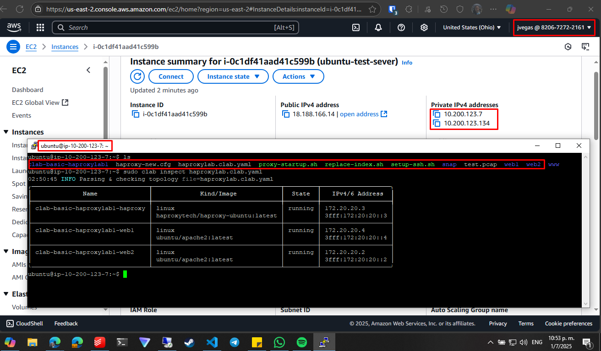
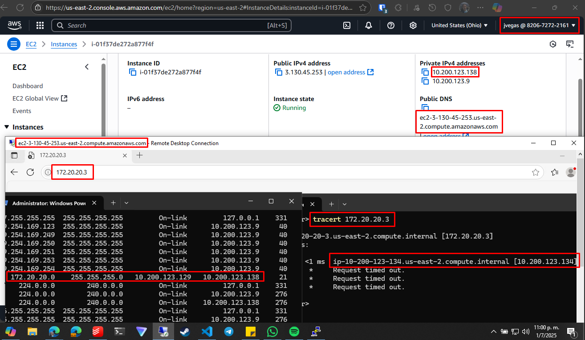

# Load Balancer with HAProxy Journal

## Environment

An AWS EC2 instance running an Ubuntu server with **containerlab** (and **docker**) installed was used to run the containers needed for this proof of concept (a load balancer and two web servers).

Also, another EC2 instance running Windows Server 2025 was used to request the pages in the web servers behind the load balancer.

## Deployment

**Containerlab** is a set of tools to run container-based networking labs in a versatile way.

Even if **docker** is required to build the containers, **containerlab** allows for the easy creation of connections between the containers that would define a given topology, something for what **docker-compose** tools are not a good fit.

**Containerlab** was used in this instance to build a load balancer running on an Ubuntu container. The load balancer was configured with **HAProxy** (an open source tool with load balancing and proxy capabilities for HTTP applications).

Two Apache based web servers were built behind the load balancer.

In the following image, you can see the base files and scripts used to deploy the lab and the output of the `clab inspect` command which shows the running containers along with the network configuration. All containers are in the `172.20.20.0/24` network.

Next, you can see the request to the load balancer IP (`172.20.20.3`) from the Windows Server machine. The expected behavior would be for the load balancer to redirect the request to any of the available web servers in a round robin basis, unfortunately the request failed with a timeout error.

Because the Windows machine doesn't have a pre-configured route to the `172.20.20.0/24` network (as this network is configured inside the Ubuntu host) I proceeded to check for errors in the route I created for this purpose. As you can see above, the route is pointing requests to the **containerlab** network to exit through the gateway of the private interface (`10.200.123.138`) which is correct.

Also, on the left, you can see the `tracert` output to the load balancer IP which shows the traffic is routed successfully to the private interface of the Ubuntu machine (`10.200.123.134`) but not to the load balancer.

This routing is possible because a custom route was also created in the AWS route table for the subnet in which the Windows Server EC2 instance private interface is set (see next image). This allows for the traffic headed for `172.20.20.0/24` through the Windows Server private interface to reach the Ubuntu private interface.

Finally, we checked that the Ubuntu private interface isn't dropping traffic not addressed to it directly:

This step is necessary because this interface is not in the `172.20.20.0/24` network but in `10.200.123.0/24`, so by default it would drop all other traffic even if there is a route pointing to it.

Even after checking all these configurations were correct, the requests to the load balancer kept failing so more time is needed to determine why this is happening.

This project will be updated when progress is made.
