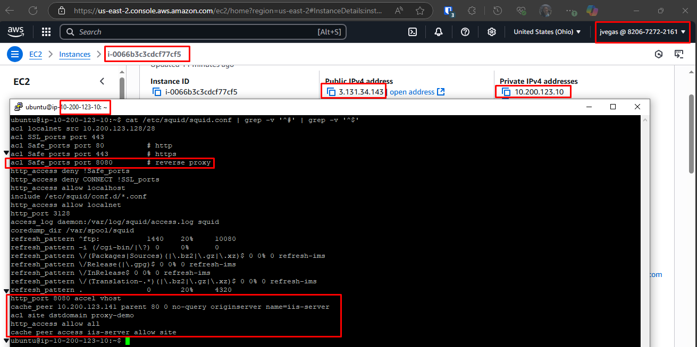
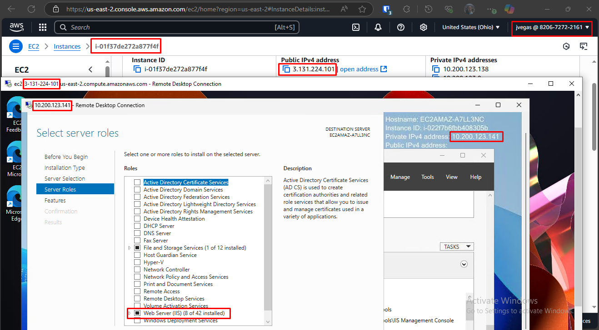
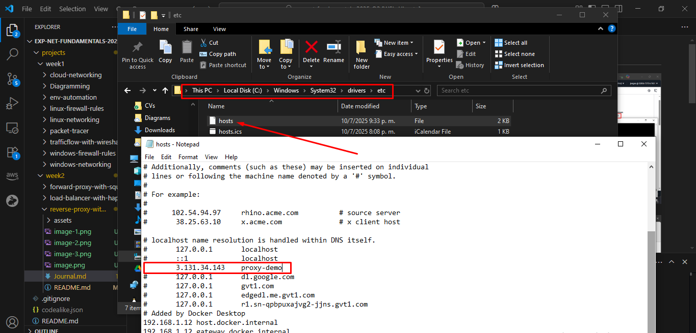
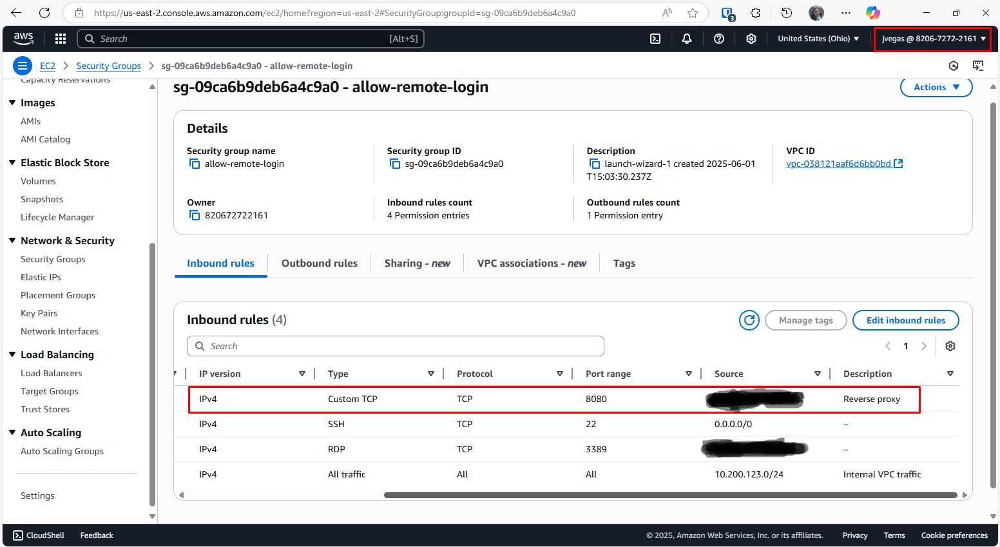
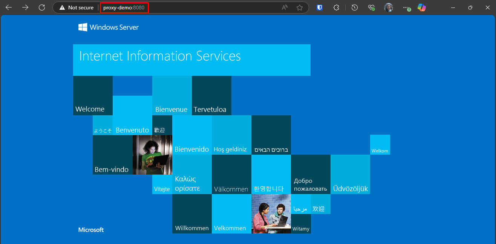
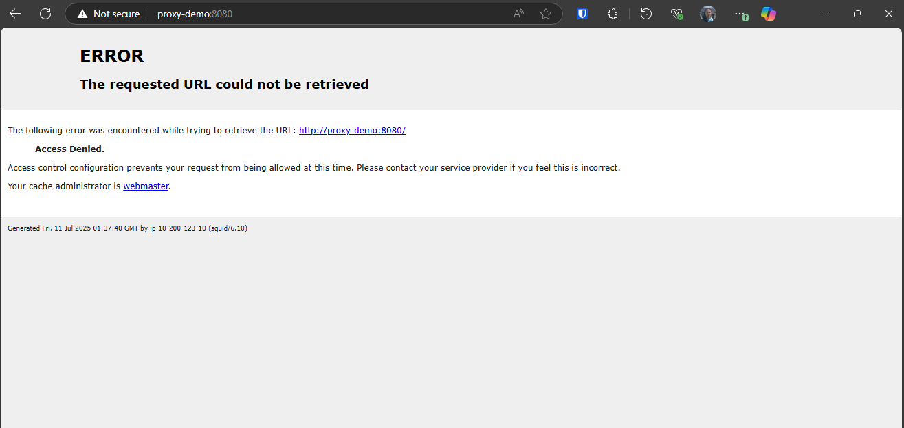

# Reverse Proxy with Squid

## Environment

An AWS EC2 instance running Ubuntu with the **squid** package installed was used to set up the reverse web proxy server for this proof of concept.

Two more EC2 instances running Windows Server 2025 were deployed:

- Origin server – no public IP; IIS role installed to serve a test webpage. All external requests to the test webpage must go through the reverse web proxy server.
- Jump box – RDP bastion host used to manage the origin server as it lacks a public IP.

Also, a personal Windows PC was used to test the reverse proxy by making requests to the origin server.

## Deployment

The basic idea behind this implementation was to configure a reverse web proxy which would redirect all client requests to the http://proxy-demo:8080 URL to an origin server (not exposed to the internet) that served an IIS test webpage.

Below, you can see an output showing a reverse web proxy configuration running on Ubuntu. You can set it up by [following this steps](./README.md).



Note that the origin server's IP is **10.200.123.141** and the reverse web proxy should redirect requests made to the **proxy-demo** domain on **port 8080**.

If you run: 

```sh
sudo systemctl status squid
```

You should see an output similar to:


Above, you can see the reverse proxy server is listening for request on the port 8080.

Next, the Windows jump box was used to make an RDP connection to the origin server (**10.200.123.141**)



In the image above, you can see the origin server was configured with the IIS role so that it could serve the default webpage for testing purposes. If you need help to set up IIS, [follow this steps](https://learn.microsoft.com/en-us/iis/web-hosting/web-server-for-shared-hosting/installing-the-web-server-role).

Below, you can see the configuration of the hosts file on my personal PC. This step was necessary as the **proxy-demo** domain wasn't publicly registered so requests made to it would fail. A workaround consist in configuring the hosts file to point the **proxy-demo** domain to the reverse proxy server public IP (**3.131.34.143**). DO NOT use this solution for production environments.



Also, a rule was added in the AWS security group associated with the reverse proxy server to allow incoming traffic to **port 8080**:



Then, when I went to http://proxy-demo:8080 I could reach the origin server through the reverse web proxy server:



If there is a problem with the reverse proxy server configuration you may receive the following error:



Please let me know is you encounter this problem to schedule a troubleshooting session.
