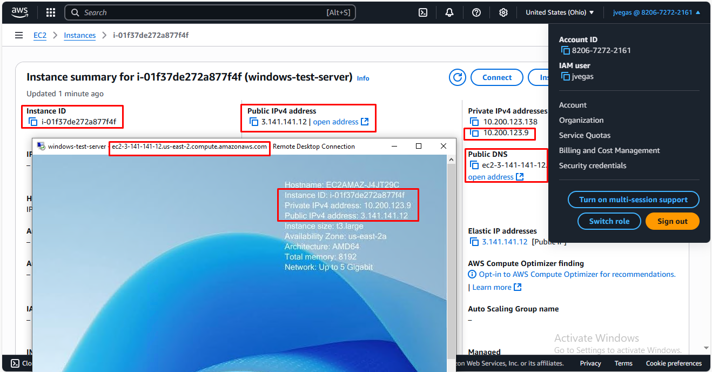

# Windows Networking

## Developer Environment



The developer environment is configured in an EC2 instance of AWS which is running Windows Server 2025. It has two NICs attached (one with an associated Elastic IP address for remote administration) and one private IP configured in each one.

I'm using Windows Remote Desktop to connect to the EC2 instance and PowerShell to run all the commands.

## IPConfig

```PowerShell
PS C:\Users\Administrator> ipconfig

Windows IP Configuration


Ethernet adapter Ethernet:

   Connection-specific DNS Suffix  . : us-east-2.compute.internal
   Link-local IPv6 Address . . . . . : fe80::916d:cb2d:da72:7d22%5
   IPv4 Address. . . . . . . . . . . : 10.200.123.9
   Subnet Mask . . . . . . . . . . . : 255.255.255.240
   Default Gateway . . . . . . . . . : 10.200.123.1

Ethernet adapter Ethernet 2:

   Connection-specific DNS Suffix  . : us-east-2.compute.internal
   Link-local IPv6 Address . . . . . : fe80::5e80:8c23:6637:ed35%2
   IPv4 Address. . . . . . . . . . . : 10.200.123.138
   Subnet Mask . . . . . . . . . . . : 255.255.255.240
   Default Gateway . . . . . . . . . : 10.200.123.129
```

Output of the `ipconfig` command showing two network interfaces configured, each one with a private IP address, a subnet mask and a default gateway.

## Ping

```PowerShell
PS C:\Users\Administrator> ping exampro.co

Pinging exampro.co [108.156.172.35] with 32 bytes of data:
Reply from 108.156.172.35: bytes=32 time=1ms TTL=249
Reply from 108.156.172.35: bytes=32 time=1ms TTL=249
Reply from 108.156.172.35: bytes=32 time=1ms TTL=249
Reply from 108.156.172.35: bytes=32 time=1ms TTL=249

Ping statistics for 108.156.172.35:
    Packets: Sent = 4, Received = 4, Lost = 0 (0% loss),
Approximate round trip times in milli-seconds:
    Minimum = 1ms, Maximum = 1ms, Average = 1ms
```

Successful `ping` command to the exampro.co webpage proving ICMP traffic is enabled.

## Tracert

```PowerShell
PS C:\Users\Administrator> tracert exampro.co

Tracing route to exampro.co [108.156.172.55]
over a maximum of 30 hops:

  1    43 ms     1 ms     1 ms  100.64.88.11
  2     *        *        *     Request timed out.
  3     *        *        *     Request timed out.
  4     *        *        *     Request timed out.
  5     *        *        *     Request timed out.
  6    <1 ms    <1 ms    <1 ms  108.166.244.3
  7     *        *        *     Request timed out.
  8     *        *        *     Request timed out.
  9     *        *        *     Request timed out.
 10     *        *        *     Request timed out.
 11     *        *        *     Request timed out.
 12     1 ms     1 ms     1 ms  15.230.180.1
 13     2 ms     1 ms     2 ms  server-108-156-172-55.cmh68.r.cloudfront.net [108.156.172.55]
```

`tracert` command pointing to the exampro.co webpage showing a total of 13 hops to reach its destination from the AWS platform to Cloudfront's servers.

## Netstat

```PowerShell
PS C:\Users\Administrator> netstat

Active Connections

  Proto  Local Address          Foreign Address        State
  TCP    10.200.123.9:3389      198.134.245.60:59291   ESTABLISHED
  TCP    10.200.123.9:49802     20.59.87.226:https     ESTABLISHED
  TCP    10.200.123.9:49846     20.59.87.226:https     ESTABLISHED
```

Output of the `netstat` command showing 3 established connections in the public interface (one of them is the RDP session)

## Route

```PowerShell 
PS C:\Users\Administrator> route print
===========================================================================
Interface List
  5...02 4a 18 7e fa c5 ......Amazon Elastic Network Adapter
  2...02 cb 42 fe b6 e5 ......Amazon Elastic Network Adapter #2
  1...........................Software Loopback Interface 1
===========================================================================

IPv4 Route Table
===========================================================================
Active Routes:
Network Destination        Netmask          Gateway       Interface  Metric
          0.0.0.0          0.0.0.0   10.200.123.129   10.200.123.138     20
          0.0.0.0          0.0.0.0     10.200.123.1     10.200.123.9     20
     10.200.123.0  255.255.255.240         On-link      10.200.123.9    276
     10.200.123.9  255.255.255.255         On-link      10.200.123.9    276
    10.200.123.15  255.255.255.255         On-link      10.200.123.9    276
   10.200.123.128  255.255.255.240         On-link    10.200.123.138    276
   10.200.123.138  255.255.255.255         On-link    10.200.123.138    276
   10.200.123.143  255.255.255.255         On-link    10.200.123.138    276
        127.0.0.0        255.0.0.0         On-link         127.0.0.1    331
        127.0.0.1  255.255.255.255         On-link         127.0.0.1    331
  127.255.255.255  255.255.255.255         On-link         127.0.0.1    331
  169.254.169.123  255.255.255.255         On-link      10.200.123.9     40
  169.254.169.249  255.255.255.255         On-link      10.200.123.9     40
  169.254.169.250  255.255.255.255         On-link      10.200.123.9     40
  169.254.169.251  255.255.255.255         On-link      10.200.123.9     40
  169.254.169.253  255.255.255.255         On-link      10.200.123.9     40
  169.254.169.254  255.255.255.255         On-link      10.200.123.9     40
        224.0.0.0        240.0.0.0         On-link         127.0.0.1    331
        224.0.0.0        240.0.0.0         On-link      10.200.123.9    276
        224.0.0.0        240.0.0.0         On-link    10.200.123.138    276
  255.255.255.255  255.255.255.255         On-link         127.0.0.1    331
  255.255.255.255  255.255.255.255         On-link      10.200.123.9    276
  255.255.255.255  255.255.255.255         On-link    10.200.123.138    276
===========================================================================
Persistent Routes:
  None

IPv6 Route Table
===========================================================================
Active Routes:
 If Metric Network Destination      Gateway
  1    331 ::1/128                  On-link
  5     40 fd00:ec2::123/128        On-link
  5     40 fd00:ec2::250/128        On-link
  5     40 fd00:ec2::253/128        On-link
  5     40 fd00:ec2::254/128        On-link
  5    276 fe80::/64                On-link
  2    276 fe80::/64                On-link
  2    276 fe80::5e80:8c23:6637:ed35/128
                                    On-link
  5    276 fe80::916d:cb2d:da72:7d22/128
                                    On-link
  1    331 ff00::/8                 On-link
  5    276 ff00::/8                 On-link
  2    276 ff00::/8                 On-link
===========================================================================
Persistent Routes:
  None
```

Output of the `route print` command showing the interface list and the route tables for both IPV6 and IPV4.
